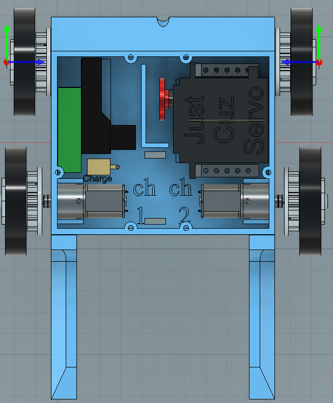

# Assembly Instructions
Not where you want to be?

[Troubleshooting guide](TROUBLESHOOTING.md)

[README](README.md)

[Electronics guide](ELECTRONICS.md)

## Power switch
1. Unscrew the nut from the power switch. Push the charge jack port through the hole in the bottom of the chassis with the wires pointed towards the inside of the chassis. Make sure the charge jack lines up with the rectangle on the chassis.
1. Screw the nut back onto the charge jack and tighten it with pliers.
1. Plug in the switch: the robot is now off.
1. Plug the red and black power switch wires into the red and black power distribution blocks, respectively.

## Drive motors
1. Screw the drive motor mounts onto the outside of the chassis.
1. Place one drive motor in each motor mount with the Repeat Robotics logo facing upwards.
1. Plug in the blue and purple wires on the ESCs to a motor with the **blue** wire towards the **back** of the robot. *Note that the wires are plugged in diferently on each motor. This is important. If they are reversed, the robot will drive funny.*
***You may want to solder the connections for battle. When the wires have been plugged and unplugged a couple of times, the connections get loose. I have lost battles because the motors came unplugged.***
1. Plug the ESC wires into the reciever channel indicated by the writing inside the chassis. The brown wire goes towards the outside of the reciever. *If the wire are plugged in backwards, nothing will blow up but the motors won't move.*
1. Plug the red and black ESC wires into the red and black power distribution blocks, respectively.
1. Screw the motors to the motor mounts.

### Wheels
1. Screw the grub screws into the twist hubs.
1. Mark with a Sharpie on the flat part of the twist hub where the grub screw is.
1. Push a wheel onto a twist hub.
1. Take a 3d printed twist hub pulley piece and twist it onto the twist hub.
1. Push an allen wrench into the foam wheel to get to the grub screw.
1. Slide the hub onto the motor output shaft with the 3d printed part towards the robot and tighten the grub screw on the flat side.
1. Repeat steps 1 through 4 for another wheel.
1. Loop a TPU belt over the pulley on the wheel you just mounted and the wheel you have prepared.
1. Use a shoulder bolt to attach the  wheel to the back of the robot.
1. Repeat for the other side.

## Servo
### Give the servo extra power
1. Cut the red center wire out of the PWM cable connector.
1. Strip the end of the wire that is connected to the servo.
1. Solder a wire extension to the end of the wire and put heat shrink or electrical tape around it so there is no bare wire that can short.
1. Plug the wire extension into the red power distribution block.

### Mount servo
1. With the servo horn on the front and the servo body on the right, screw the servo mounts to the servo.
1. Press the servo horn onto the servo and screw it in.
1. Screw the 18 tooth gear onto the servo horn.
1. Plug the PWM cable into channel 3 on the reciever with the brown wire towards the outside of the reciever.
1. Place the servo in the chassis so the servo mounts line up with the blocks in the chassis and the servo gear fits inside the wall in the chassis. Make sure the servo wire goes under the mounts and gear along the back wall of the chassis. Screw the mounts into the chassis.

## Test
Now it's time to test the robot! Double check the red wires are in the red power distribution block and the black wires are in the black block. Make sure the charge jack is plugged into the switch. Elevate the robot off the table by placing it on a small box or holding it in the air. *The wood screw box  or battery box might work well for this.*
Plug the battery into the JST connector on the switch.
Turn the transmitter on first, and then the robot. The controls on the right are the drive controls. The ones on the left are servo controls.
*Note: It's okay if the drive motors are spinning or motors are whining. That will be fixed in the next step.*

## Trim motors
Near each joystick for controling the motors there is two sliders. These are for adjusting the trim, or where the center actually is.
Move all the sliders to the center for right now.
### ESC Calibration
1. On the ESC, find a label for 'Calibrate' near where the PWM cables exit. With the robot on and transmitter off, briefly short the pads. Do this for both ESCs. The light should flash red and green alternately.
2. Turn on the transmitter and move the drive controls to the maximum, minimum, and then center.
3. Turn off the transmitter and briefly short the pads on the ESCs again. The light will flash twice and turn on solid.
The ESCs now know exactly what signals the transmitter and reciever send, and so they can work exactly like you want without having to adjust the trim.

### Servo trimming
Servos do not have ESCs to calibrate. If the servo is humming, then you need to adjust the trim. Move the up and down slider slowly one way. If the sound gets worse or the servo moves, then you are going the wrong way. Move it the other way until you find the spot where the servo is no longer humming.

Move the servo to the top position and turn the robot off by plugging in the switch.

## Finish assembly
### Wire management

Place the battery and reciever where the markings on the chassis indicate. Wires can go above the "CH 1" and "CH 2" markings.
Find the zip tie slots in the chassis and zip tie all the wires down with the reusable zip tie.
The reusable zip tie is so that you don't need to cut a thick zip tie right next to thin, easy to cut wires.

### Top plate assembly

1. Screw the bottom jaw bar pieces to the 'scoop' piece (with the card suit symbols on it). The nubs sticking out should be towards the middle.
1. Align the holes in the end of the bars with the nubs on the top plate with the scoop part facing away from the slot in the top plate. Place the 12 tooth gear between the nubs and slide a shaft through all the pieces.
1. Use two shaft collars to hold the shaft in place.
1. Place the shark arm gear between the bars with the gear meshing with the 12 tooth gear. Slide a shaft through the bars and the shark arm.
1. Secure with shaft collars.

### Attach top plate
1. With the servo in the topmost position, lift the shark arm to the highest position and carefully set the top plate assembly on top of the robot. *Note: Make sure no wires are pinched in the top plate.*
1. Screw the top plate to the chassis. Move the shark arm and bottom jaw together to force the servo to move so the final screws are accessible.

### Chassis attachments
1. Screw two forks to the front of the chassis with the slanted side facing outwards. *Note that the forks are different for each side of the robot*
1. Screw a back armor piece to the back of the chassis.

# You are finished assembling Ace of Sharks!
Congrats! Learn to drive the robot by driving around cones or markers or just pushing small boxes around.
I like to use a sharpie to color in the indented parts on the shark arm and use paint to color the raised parts on the top plate and bottom jaw.
Have fun!

If you want to learn more about your robot, check out the [electronics guide](ELECTRONICS.md) to learn what each component does and some of the signals that a part is or is not working.

Check out the [troubleshooting guide](TROUBLESHOOTING.md) if your robot is not working as it should.
