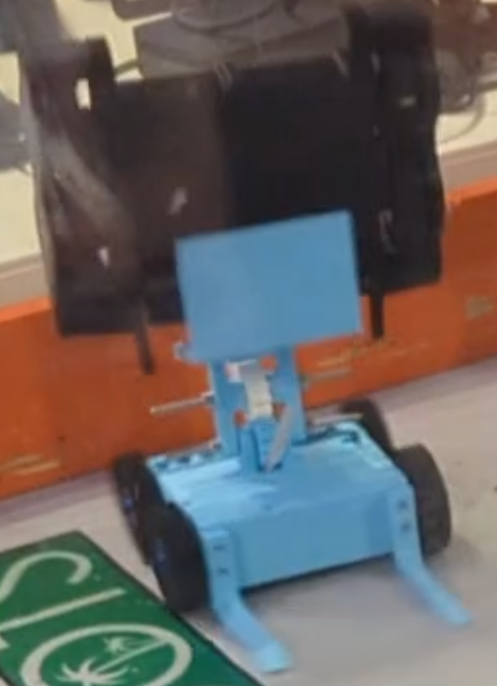
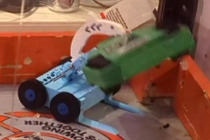

# Ace of Sharks Combat Robot

**Ace of Sharks is a plastic antweight (1 lb) combat robot with a compound grab and lift motion powered by a single servo.**

## Features

- Servo powered clamping motion
- Lifting motion powered by the same servo
- Two wheel drive (Four wheel drive coming soon)
- 3d printed belts for wheels (coming soon)
- Gear train for the weapon
- Only 6 screws to access the internal electronics

## Design decisions
Ace of Sharks uses the 'greedy snake' mechanism used in BattleBots like Claw Viper. The gear train and positioning of axles allows the motion to switch direction when the shark arm is clamped down on top of the other robot.
Positioning the servo in the back of the robot and the drive motors in the front gives Ace of Sharks an advantage because the center of mass will be positioned closer to the back of the robot. This allows the front forks to be shorter and still be able to lift an opponent. Additionally, having the drive motors in the front may let those wheels be slightly stronger, which is important for driving while carrying another combat robot.

## Credits
- The [Ask Aaron site](runamok.tech/AskAaron/weapon.html#greedy) had an animation of the Greedy Snake mechanism which I referenced.
- The [RioBotz book](studylib.net/doc/26042423/riobotz-combot-tutorial--1-?p=203) had detailed information on how a grabber bot should be laid out to work best.
- Someone commented on [this Reddit post]() with a detailed description of the Greedy Snake mechanism which helped me a lot with creating Ace of Sharks.

## Assembling the robot

See the [assembly instructions](BUILD.md) to assemble your own version of Ace of Sharks!

## Troubleshooting

See the [troubleshooting guide](TROUBLESHOOTING.md) if your robot is not working as it should.

## More information

Check out the [electronics guide](ELECTRONICS.md) if you want to learn more about what each electronic component does.

## Bill of Materials

- 2x [Repeat Robotics 16mm Gearmotors](https://repeat-robotics.com/products/repeat-mini-brushed-mk2-1pcs?variant=52037132550325)
- 2x [FingerTech TinyESC](https://www.fingertechrobotics.com/proddetail.php?prod=ft-tinyESCv3) (or 3d printed versions if the aluminum ones are out of stock)
- 2x [Drive Motor Mounts](https://palmbeachbots.com/products/ant-drive-motor-mount-carbon-fiber-fits-repeat-and-silver-sparks?_pos=1&_sid=44b7ad527&_ss=r)
- 4x [FingerTech Twist Hubs](https://www.fingertechrobotics.com/proddetail.php?prod=ft-twist-hubs)
- 4x [FingerTech Foam Wheels](https://www.fingertechrobotics.com/proddetail.php?prod=ft-foam-wheels)
- [FingerTech Servo Mounts](https://www.fingertechrobotics.com/proddetail.php?prod=ft-servo-mount)
- [FingerTech Power Distribution Blocks](https://www.fingertechrobotics.com/proddetail.php?prod=charge-switch)
- [FingerTech JST Power Switch and Charge Jack](https://www.fingertechrobotics.com/proddetail.php?prod=charge-switch)
- [LiPo battery](https://palmbeachbots.com/products/palm-power-2s-250mah-45c-lipo-battery?_pos=10&_sid=9b1d04b51&_ss=r)
- [Just &#39;Cuz Robotics servo](https://justcuzrobotics.com/products/servo-32kg?_pos=2&_sid=bcd662365&_ss=r)
- [Round servo horn](https://www.amazon.com/SQXBK-Aluminum-Standard-Accessories-Steering/dp/B09LTVLM12)
- Transmitter and receiver *FlySky FS-i6 or FlySky FS-i6x are popular transmitters*
- #4 x 1/2 in wood screws
- M2x4mm Screws to mount drive motors
- 2x 3mm shafts
- 4x 3mm shaft collars
- 3mm by 20mm shoulder bolts
- Extra wire
- Heat shrink or electrical tape

*Some tournaments require a clearly visible power LED. If so, use a [FingerTech Superbright Power LED](https://www.fingertechrobotics.com/proddetail.php?prod=ft-power-led). Plug it into the BATTERY channel on the receiver and place it near the edge of the chassis.*

***Many parts can be bought from multiple sites if you want to minimize the number of separate purchases.***

*List also in [BOM.csv](BOM.csv).*

### Tools

- Phillips head screwdriver (for wood screws)
- Needle nose pliers
- Twist hub key (Optional, needle nose pliers will work as well)
- Soldering iron
- Heat gun (only if using heat shrink)

## Links

See devlogs and the journey of making Ace of Sharks [here!](https://stardance.hackclub.com/projects/12008)

See the [troubleshooting guide](TROUBLESHOOTING.md) if your robot is not working as it should.

See the [assembly instructions](BUILD.md) to assemble your own version of Ace of Sharks!

See the [electronics guide](ELECTRONICS.md) to learn what each electronics component does.

See the [print settings guide](PRINT.md) for print settings.
